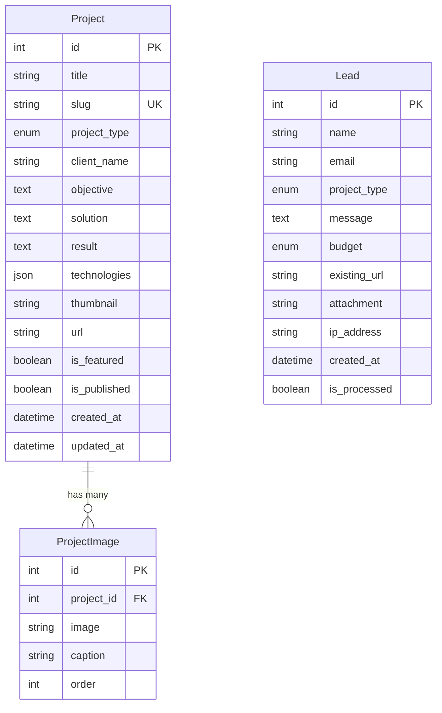

# Design Document — Site Officiel Trait d'Union Studio

## Overview

Ce document décrit l'architecture technique et le design du site vitrine officiel de Trait d'Union Studio (TUS). Le site est construit avec Django (backend), HTMX (interactions dynamiques), et un design system sur-mesure respectant la charte graphique luxe-tech sobre.

**Stack technique :**
- Backend : Python 3.11+ / Django 5.x
- Frontend : Django Templates + HTMX + Vanilla JS
- CSS : Tailwind CSS avec configuration custom TUS
- Base de données : SQLite (dev) / PostgreSQL (prod)
- Email : Django Email Backend (dev) / Postmark/Brevo (prod)

**Principes directeurs :**
- Luxe discret : espace, typographie, rythme
- Performance : site léger, chargement rapide
- Maintenabilité : architecture modulaire, code propre

---

## Architecture

### Architecture Globale

```
┌─────────────────────────────────────────────────────────────────┐
│                         CLIENT (Browser)                         │
│  ┌─────────────┐  ┌─────────────┐  ┌─────────────────────────┐  │
│  │   HTML/CSS  │  │    HTMX     │  │   Vanilla JS (minimal)  │  │
│  └─────────────┘  └─────────────┘  └─────────────────────────┘  │
└─────────────────────────────────────────────────────────────────┘
                              │
                              ▼
┌─────────────────────────────────────────────────────────────────┐
│                      DJANGO APPLICATION                          │
│  ┌──────────────────────────────────────────────────────────┐   │
│  │                      URL Router                           │   │
│  └──────────────────────────────────────────────────────────┘   │
│                              │                                   │
│       ┌──────────────────────┼──────────────────────┐           │
│       ▼                      ▼                      ▼           │
│  ┌─────────┐           ┌─────────┐           ┌─────────┐        │
│  │  pages  │           │portfolio│           │  leads  │        │
│  │   app   │           │   app   │           │   app   │        │
│  └─────────┘           └─────────┘           └─────────┘        │
│       │                      │                      │           │
│       └──────────────────────┼──────────────────────┘           │
│                              ▼                                   │
│  ┌──────────────────────────────────────────────────────────┐   │
│  │                    Template Engine                        │   │
│  │  (base.html + partials + page templates)                  │   │
│  └──────────────────────────────────────────────────────────┘   │
│                              │                                   │
│                              ▼                                   │
│  ┌──────────────────────────────────────────────────────────┐   │
│  │                      Database                             │   │
│  │              SQLite (dev) / PostgreSQL (prod)             │   │
│  └──────────────────────────────────────────────────────────┘   │
└─────────────────────────────────────────────────────────────────┘
```

### Structure des Apps Django

```
tus_website/
├── config/                    # Configuration Django
│   ├── settings/
│   │   ├── base.py           # Settings communs
│   │   ├── development.py    # Settings dev
│   │   └── production.py     # Settings prod
│   ├── urls.py               # URL racine
│   └── wsgi.py
├── apps/
│   ├── pages/                # Pages statiques
│   │   ├── views.py
│   │   ├── urls.py
│   │   └── templates/pages/
│   ├── portfolio/            # Réalisations
│   │   ├── models.py
│   │   ├── views.py
│   │   ├── urls.py
│   │   └── templates/portfolio/
│   ├── leads/                # Formulaire contact
│   │   ├── models.py
│   │   ├── forms.py
│   │   ├── views.py
│   │   ├── urls.py
│   │   └── templates/leads/
│   └── resources/            # Ressources téléchargeables
│       ├── views.py
│       ├── urls.py
│       └── templates/resources/
├── templates/
│   ├── base.html             # Template de base
│   ├── partials/             # Composants réutilisables
│   │   ├── navbar.html
│   │   ├── footer.html
│   │   ├── cards/
│   │   └── forms/
│   └── components/           # UI Kit
├── static/
│   ├── css/
│   ├── js/
│   ├── images/
│   └── fonts/
├── media/                    # Uploads utilisateurs
└── manage.py
```

---

## Components and Interfaces

### 1. App Pages — Vues et Templates

```python
# apps/pages/views.py

class HomeView(TemplateView):
    """
    Page d'accueil TUS.
    Affiche slogan, aperçu des 3 offres, preuves qualité, CTAs.
    """
    template_name: str = "pages/home.html"
    
    def get_context_data(self) -> dict:
        """Retourne le contexte avec services et témoignages."""
        pass

class ServicesView(TemplateView):
    """
    Page Services avec 3 blocs d'offre.
    """
    template_name: str = "pages/services.html"

class MethodView(TemplateView):
    """
    Page Méthode avec processus en 5 étapes.
    """
    template_name: str = "pages/method.html"

class LegalView(TemplateView):
    """
    Pages légales (mentions, confidentialité).
    """
    template_name: str  # Dynamique selon le type
```

### 2. App Portfolio — Modèles et Vues

```python
# apps/portfolio/models.py

class ProjectType(models.TextChoices):
    """Types de projets pour filtrage."""
    VITRINE = "vitrine", "Site Vitrine"
    COMMERCE = "commerce", "E-commerce"
    SYSTEME = "systeme", "Plateforme / Mini-ERP"

class Project(models.Model):
    """
    Modèle représentant un projet réalisé.
    """
    title: str                          # Titre du projet
    slug: str                           # URL-friendly identifier
    project_type: ProjectType           # Type de projet
    client_name: str                    # Nom du client (optionnel)
    objective: str                      # Objectif du projet
    solution: str                       # Solution apportée
    result: str                         # Résultat obtenu
    technologies: list[str]             # Stack technique utilisée
    thumbnail: ImageField               # Image miniature
    images: list[ImageField]            # Galerie d'images
    url: str                            # URL du projet (optionnel)
    is_featured: bool                   # Mis en avant sur l'accueil
    is_published: bool                  # Publié ou brouillon
    created_at: datetime
    updated_at: datetime

# apps/portfolio/views.py

class ProjectListView(ListView):
    """
    Liste des réalisations avec filtrage HTMX.
    """
    model = Project
    template_name: str = "portfolio/project_list.html"
    context_object_name: str = "projects"
    
    def get_queryset(self) -> QuerySet[Project]:
        """Filtre par type si paramètre présent."""
        pass
    
    def get_template_names(self) -> list[str]:
        """Retourne partial si requête HTMX."""
        pass

class ProjectDetailView(DetailView):
    """
    Détail d'un projet (page ou modal).
    """
    model = Project
    template_name: str = "portfolio/project_detail.html"
```

### 3. App Leads — Formulaire Intelligent

```python
# apps/leads/models.py

class ProjectTypeChoice(models.TextChoices):
    """Types de projet pour le formulaire."""
    VITRINE = "vitrine", "Site Vitrine"
    ECOMMERCE = "ecommerce", "E-commerce"
    PLATEFORME = "plateforme", "Plateforme / Mini-ERP"

class BudgetRange(models.TextChoices):
    """Fourchettes de budget indicatif."""
    SMALL = "small", "< 3 000 €"
    MEDIUM = "medium", "3 000 € - 8 000 €"
    LARGE = "large", "8 000 € - 15 000 €"
    ENTERPRISE = "enterprise", "> 15 000 €"
    DISCUSS = "discuss", "À discuter"

class Lead(models.Model):
    """
    Modèle représentant une demande de contact.
    """
    name: str                           # Nom complet
    email: str                          # Email de contact
    project_type: ProjectTypeChoice     # Type de projet
    message: str                        # Message détaillé
    budget: BudgetRange                 # Budget indicatif (optionnel)
    existing_url: str                   # URL site existant (optionnel)
    attachment: FileField               # Pièce jointe (optionnel)
    honeypot: str                       # Champ anti-spam (doit être vide)
    ip_address: str                     # IP pour rate limiting
    created_at: datetime
    is_processed: bool                  # Traité par l'équipe
    
    class Meta:
        ordering = ["-created_at"]

# apps/leads/forms.py

class ContactForm(forms.ModelForm):
    """
    Formulaire de contact intelligent.
    Champs dynamiques selon le type de projet.
    """
    class Meta:
        model = Lead
        fields = ["name", "email", "project_type", "message", 
                  "budget", "existing_url", "attachment", "honeypot"]
    
    def clean_honeypot(self) -> str:
        """Valide que le honeypot est vide (anti-spam)."""
        pass
    
    def clean_attachment(self) -> File:
        """Valide type et taille du fichier uploadé."""
        pass

class DynamicFieldsForm(forms.Form):
    """
    Formulaire partiel pour champs dynamiques HTMX.
    Retourne les champs additionnels selon project_type.
    """
    pass

# apps/leads/views.py

class ContactView(FormView):
    """
    Vue principale du formulaire de contact.
    """
    template_name: str = "leads/contact.html"
    form_class = ContactForm
    success_url: str = "/contact/success/"
    
    def form_valid(self, form: ContactForm) -> HttpResponse:
        """Sauvegarde le lead et envoie les emails."""
        pass
    
    def get_client_ip(self) -> str:
        """Extrait l'IP du client pour rate limiting."""
        pass

class DynamicFieldsView(View):
    """
    Endpoint HTMX pour champs dynamiques.
    GET /contact/fields/?type=ecommerce
    """
    def get(self, request: HttpRequest) -> HttpResponse:
        """Retourne le partial avec champs adaptés."""
        pass

class ContactSuccessView(TemplateView):
    """
    Page de confirmation après soumission.
    """
    template_name: str = "leads/success.html"
```

### 4. App Resources — Téléchargements

```python
# apps/resources/views.py

class ResourcesView(TemplateView):
    """
    Page listant les ressources téléchargeables.
    """
    template_name: str = "resources/index.html"

class DownloadView(View):
    """
    Sert les fichiers PDF en téléchargement.
    """
    ALLOWED_FILES: dict = {
        "checklist": "checklist-projet-web-premium.pdf",
        "cahier-des-charges": "modele-cahier-des-charges.pdf",
    }
    
    def get(self, request: HttpRequest, filename: str) -> FileResponse:
        """Retourne le fichier PDF demandé."""
        pass
```

### 5. Services Email

```python
# apps/leads/services.py

class EmailService:
    """
    Service d'envoi d'emails pour les leads.
    """
    
    @staticmethod
    def send_confirmation_email(lead: Lead) -> bool:
        """
        Envoie un email de confirmation au prospect.
        Inclut récapitulatif de la demande et délai de réponse.
        """
        pass
    
    @staticmethod
    def send_admin_notification(lead: Lead) -> bool:
        """
        Notifie l'administrateur TUS d'une nouvelle demande.
        Inclut tous les détails du lead.
        """
        pass
```

### 6. Middleware et Sécurité

```python
# config/middleware.py

class RateLimitMiddleware:
    """
    Middleware de rate limiting pour le formulaire de contact.
    Limite : 5 soumissions par IP par heure.
    """
    RATE_LIMIT: int = 5
    WINDOW_SECONDS: int = 3600
    
    def __call__(self, request: HttpRequest) -> HttpResponse:
        """Vérifie le rate limit avant traitement."""
        pass

class SecurityHeadersMiddleware:
    """
    Ajoute les headers de sécurité HTTP.
    """
    def __call__(self, request: HttpRequest) -> HttpResponse:
        """Ajoute X-Frame-Options, X-Content-Type-Options, etc."""
        pass
```

---

## Data Models

### Diagramme Entité-Relation



### Validation des Données

```python
# Contraintes de validation

class LeadValidation:
    """Règles de validation pour les leads."""
    
    NAME_MAX_LENGTH: int = 100
    EMAIL_MAX_LENGTH: int = 254
    MESSAGE_MIN_LENGTH: int = 20
    MESSAGE_MAX_LENGTH: int = 5000
    URL_MAX_LENGTH: int = 500
    
    ALLOWED_FILE_TYPES: list[str] = [
        "application/pdf",
        "application/msword",
        "application/vnd.openxmlformats-officedocument.wordprocessingml.document"
    ]
    MAX_FILE_SIZE_MB: int = 5

class ProjectValidation:
    """Règles de validation pour les projets."""
    
    TITLE_MAX_LENGTH: int = 200
    SLUG_MAX_LENGTH: int = 200
    OBJECTIVE_MAX_LENGTH: int = 1000
    SOLUTION_MAX_LENGTH: int = 2000
    RESULT_MAX_LENGTH: int = 1000
```

---

## Correctness Properties

*A property is a characteristic or behavior that should hold true across all valid executions of a system—essentially, a formal statement about what the system should do. Properties serve as the bridge between human-readable specifications and machine-verifiable correctness guarantees.*

Les propriétés suivantes ont été dérivées des acceptance criteria après analyse de testabilité et consolidation des redondances.

---

### Property 1: Fiche projet complète

*For any* projet affiché dans la liste des réalisations, la fiche doit contenir les trois éléments obligatoires : objectif, solution et résultat.

**Validates: Requirements 3.2**

---

### Property 2: Filtrage portfolio par type

*For any* type de filtre sélectionné (Vitrine, Commerce, Système), tous les projets retournés doivent correspondre au type sélectionné, et aucun projet d'un autre type ne doit être affiché.

**Validates: Requirements 3.3**

---

### Property 3: Adaptation dynamique du formulaire

*For any* type de projet sélectionné dans le formulaire de contact, les champs affichés doivent correspondre à la configuration définie pour ce type, et les champs non pertinents doivent être masqués.

**Validates: Requirements 5.2**

---

### Property 4: Validation formulaire avec messages d'erreur

*For any* donnée invalide soumise dans le formulaire (email malformé, message trop court, champ requis vide), un message d'erreur explicite et localisé doit être affiché à côté du champ concerné.

**Validates: Requirements 5.6**

---

### Property 5: Protection anti-spam honeypot et rate limiting

*For any* soumission de formulaire avec le champ honeypot rempli OU dépassant la limite de 5 soumissions par heure par IP, la soumission doit être rejetée silencieusement sans créer de Lead en base.

**Validates: Requirements 5.7, 12.4**

---

### Property 6: Validation upload fichiers

*For any* fichier uploadé via le formulaire de contact, le système doit valider que le type MIME est dans la liste autorisée (PDF, DOC, DOCX) ET que la taille ne dépasse pas 5 Mo. Les fichiers non conformes doivent être rejetés avec un message d'erreur explicite.

**Validates: Requirements 5.8, 12.5**

---

### Property 7: Téléchargement ressources

*For any* identifiant de ressource valide (checklist, cahier-des-charges), le serveur doit retourner le fichier PDF correspondant avec le Content-Type approprié et le header Content-Disposition pour forcer le téléchargement.

**Validates: Requirements 6.3**

---

### Property 8: Focus visible navigation clavier

*For any* élément interactif (liens, boutons, champs de formulaire) recevant le focus via navigation clavier, un indicateur visuel de focus doit être affiché avec un contraste suffisant.

**Validates: Requirements 7.4, 14.3**

---

### Property 9: URLs propres et lisibles

*For any* page du site, l'URL doit être composée uniquement de caractères alphanumériques minuscules et de tirets, sans paramètres de query string pour les pages principales, et doit être descriptive du contenu.

**Validates: Requirements 7.5**

---

### Property 10: Lazy loading images

*For any* image de contenu (hors logo et images critiques above-the-fold), l'attribut loading="lazy" doit être présent pour différer le chargement.

**Validates: Requirements 10.2**

---

### Property 11: SEO meta tags par page

*For any* page du site, les balises title et meta description doivent être présentes, uniques, et les balises OpenGraph (og:title, og:description, og:image) doivent être définies.

**Validates: Requirements 11.1, 11.4**

---

### Property 12: Protection CSRF sur formulaires

*For any* formulaire POST du site, un token CSRF valide doit être inclus et vérifié côté serveur. Les requêtes sans token valide doivent être rejetées avec une erreur 403.

**Validates: Requirements 12.1**

---

### Property 13: Headers de sécurité HTTP

*For any* réponse HTTP du serveur, les headers de sécurité suivants doivent être présents : X-Frame-Options, X-Content-Type-Options, X-XSS-Protection, et Referrer-Policy.

**Validates: Requirements 12.3**

---

### Property 14: Contraste accessibilité texte

*For any* texte affiché sur fond noir (#07080A), le ratio de contraste avec la couleur du texte doit être d'au moins 4.5:1 pour le texte normal et 3:1 pour le texte large (>= 18px bold ou >= 24px).

**Validates: Requirements 14.1**

---

### Property 15: Taille texte minimale

*For any* texte de contenu (paragraphes, listes, descriptions), la taille de police doit être d'au moins 16px. Les textes d'interface (labels, boutons) peuvent descendre à 14px minimum.

**Validates: Requirements 14.2**

---

### Property 16: Labels et ARIA formulaires

*For any* champ de formulaire, un label explicite doit être associé via l'attribut for/id, et les attributs ARIA appropriés (aria-required, aria-invalid, aria-describedby) doivent être présents pour les champs avec validation.

**Validates: Requirements 14.4, 14.5**

---

### Property 17: Emails confirmation et notification round-trip

*For any* soumission valide du formulaire de contact, deux emails doivent être envoyés : un email de confirmation au prospect contenant le récapitulatif de sa demande, et un email de notification à l'administrateur contenant tous les détails du lead.

**Validates: Requirements 5.4, 5.5**

---

## Error Handling

### Stratégie Globale

Le site implémente une gestion d'erreurs à plusieurs niveaux :

1. **Validation côté client** : Feedback immédiat via attributs HTML5 et HTMX
2. **Validation côté serveur** : Django Forms avec messages d'erreur localisés
3. **Erreurs système** : Pages d'erreur personnalisées (404, 500)

### Erreurs Formulaire de Contact

| Erreur | Code | Message utilisateur | Action |
|--------|------|---------------------|--------|
| Email invalide | INVALID_EMAIL | "Veuillez entrer une adresse email valide." | Focus sur le champ |
| Message trop court | MESSAGE_TOO_SHORT | "Votre message doit contenir au moins 20 caractères." | Focus sur le champ |
| Fichier trop volumineux | FILE_TOO_LARGE | "Le fichier ne doit pas dépasser 5 Mo." | Réinitialiser le champ |
| Type de fichier non autorisé | INVALID_FILE_TYPE | "Seuls les fichiers PDF, DOC et DOCX sont acceptés." | Réinitialiser le champ |
| Rate limit dépassé | RATE_LIMITED | Aucun (rejet silencieux) | Log côté serveur |
| Honeypot rempli | SPAM_DETECTED | Aucun (rejet silencieux) | Log côté serveur |

### Erreurs Système

```python
# templates/errors/404.html
# Page 404 personnalisée avec design TUS
# Propose liens vers Accueil, Services, Contact

# templates/errors/500.html
# Page 500 personnalisée avec design TUS
# Message d'excuse + suggestion de réessayer plus tard
```

### Logging

```python
# config/settings/base.py

LOGGING = {
    'version': 1,
    'handlers': {
        'file': {
            'class': 'logging.FileHandler',
            'filename': 'logs/tus.log',
        },
        'mail_admins': {
            'class': 'django.utils.log.AdminEmailHandler',
            'level': 'ERROR',
        },
    },
    'loggers': {
        'leads': {
            'handlers': ['file'],
            'level': 'INFO',  # Log toutes les soumissions
        },
        'security': {
            'handlers': ['file', 'mail_admins'],
            'level': 'WARNING',  # Log spam et tentatives suspectes
        },
    },
}
```

---

## Testing Strategy

### Approche Duale : Tests Unitaires + Tests Property-Based

Le projet utilise une stratégie de test combinant :
- **Tests unitaires** : Cas spécifiques, edge cases, intégration
- **Tests property-based** : Propriétés universelles sur entrées générées

### Framework de Test

- **pytest** : Framework de test principal
- **pytest-django** : Intégration Django
- **hypothesis** : Property-based testing
- **factory_boy** : Génération de données de test

### Configuration Property-Based Testing

```python
# conftest.py

from hypothesis import settings

settings.register_profile("ci", max_examples=100)
settings.register_profile("dev", max_examples=20)
settings.load_profile("ci")
```

### Structure des Tests

```
tests/
├── conftest.py                    # Fixtures globales
├── factories.py                   # Factory Boy factories
├── unit/
│   ├── test_models.py            # Tests modèles
│   ├── test_forms.py             # Tests formulaires
│   ├── test_views.py             # Tests vues
│   └── test_services.py          # Tests services
├── integration/
│   ├── test_contact_flow.py      # Flow complet contact
│   ├── test_portfolio_filter.py  # Filtrage HTMX
│   └── test_download.py          # Téléchargements
└── properties/
    ├── test_portfolio_props.py   # Properties 1, 2
    ├── test_form_props.py        # Properties 3, 4, 5, 6, 16, 17
    ├── test_security_props.py    # Properties 12, 13
    ├── test_seo_props.py         # Properties 9, 11
    └── test_a11y_props.py        # Properties 8, 10, 14, 15
```

### Annotations des Tests Property-Based

Chaque test property-based doit être annoté avec :
- Le numéro de propriété du design document
- Les requirements validés

```python
# Exemple d'annotation
@given(project_type=st.sampled_from(ProjectType))
def test_portfolio_filter_returns_matching_projects(project_type):
    """
    Feature: tus-website, Property 2: Filtrage portfolio par type
    Validates: Requirements 3.3
    """
    # Test implementation
```

### Couverture Minimale

- Tests unitaires : 80% de couverture de code
- Tests property-based : 100 itérations par propriété
- Tests d'intégration : Tous les flows utilisateur critiques
